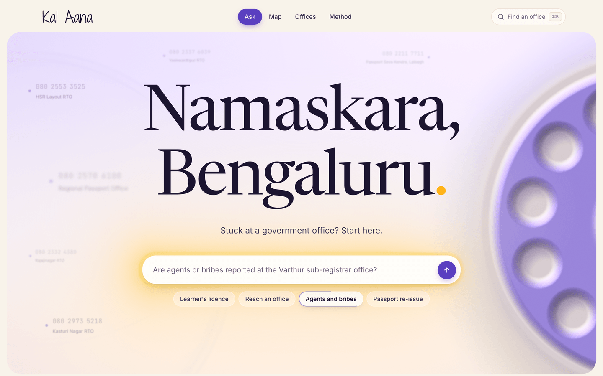
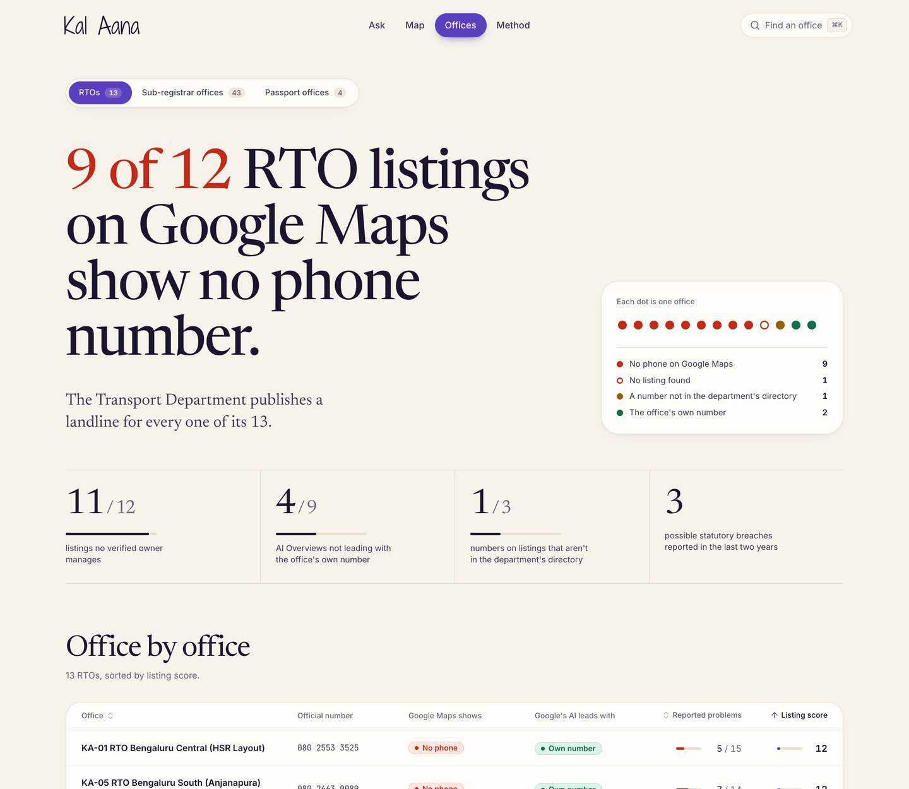
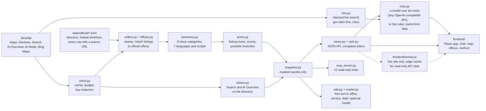

# Kal Aana

[](https://kal-aana.gradestone.in)

**"Kal aana": come back tomorrow.** Every Indian has heard it at a government counter. Kal Aana measures what Bengaluru's public offices promise against what citizens find on Google, and helps a citizen act on the gap.

**Live:** [kal-aana.gradestone.in](https://kal-aana.gradestone.in). **MCP server, nothing to install:** `https://kalaana-mcp.gradestone.in/mcp` ([setup](docs/setup.md#ai-assistants-mcp)). **Code:** [github.com/tahcin/kal-aana](https://github.com/tahcin/kal-aana).

Built for the SerpApi India Hackathon 2026 (Knowledge & Public Interest track).

## The finding

**Only 2 of 58 Google Maps listings for Bengaluru's public offices show the phone number the department publishes; 41 show no phone at all. Google's AI Overview didn't lead with the office's own number in 40 of 47 answers.** We measured this with 628 SerpApi searches across six engines, checking each office's official promises (its phone numbers, and the working days the law gives it for each service) against what citizens find on Google and report in reviews.

- **Google has the number but doesn't always show it.** Asked the same question, Google's AI Mode led with the office's own number for all 13 RTOs, but for only 1 of 42 sub-registrar offices.
- **None of the 12 phone numbers shown on sub-registrar listings is in the department's directory**, and one number outside it is the phone on two different offices' listings.
- **Bing Maps shows the same gap.** Of the 7 RTOs we could match on Bing, 5 show no phone.

Full results in [docs/findings.md](docs/findings.md) for the [13 RTOs](docs/findings.md#rtos-all-13-that-serve-bengaluru), [43 sub-registrar offices](docs/findings.md#sub-registrar-offices-all-43) and [4 passport offices](docs/findings.md#passport-offices-the-rpo-and-its-3-bengaluru-centres) that serve Bengaluru.

## Why

I passed my learner's licence test at RTO Bengaluru South (KA-05). The approval didn't come, and the official numbers I tried didn't work, though Karnataka's Sakala Act gives that office **7 working days** to issue a learner's licence. Indian public offices publish promises like these (statutory time limits under Right to Services laws, phone numbers, grievance officers), but what citizens experience is scattered across thousands of Google Maps reviews, and nobody measures one against the other, office by office. Surveys are national and periodic, and grievance portals only see complaints people bother to file.

## What you get


- **Ask** (`/`): describe your problem in your own words. It counts your working days against the legal limit, gives the office's own number, shows what Google told you instead, drafts the complaint letter, and searches government sites live for anything else.
- **Report cards** (`/offices`): every office of a type, sortable by listing score or reported problems.
- **The map** (`/map`): every office, coloured by what its Google Maps listing shows.
- **Office pages** (`/office/rto-ka05`): the promise against the reality, with every SerpApi search behind the page.
- **The method** (`/method`): the pipeline, each step explained, and the classifier's accuracy computed live.
- **MCP server** for AI assistants: twelve tools on the same data and checks as the chat, including its two live searches, so an assistant asked "how do I contact RTO South?" answers with the official number and the evidence instead of a guess ([connect it](docs/setup.md#ai-assistants-mcp), [real output](docs/mcp-example.md)).



A new office type takes [five steps](docs/add-an-office-type.md). Every feature in detail, with the MCP tools and JSON API: [docs/features.md](docs/features.md).

## Try it in 60 seconds

Python 3.11+, no API key, no Node:

```bash
git clone https://github.com/tahcin/kal-aana && cd kal-aana
python3 -m venv .venv && source .venv/bin/activate     # Windows: py -m venv .venv, then .venv\Scripts\activate
pip install -e . && kalaana serve                      # then open http://127.0.0.1:8000
```

Without keys, the chat answers from the saved data, labelled "Answered from Kal Aana's saved data (no AI model)". With a model key (any OpenAI-compatible API, such as Claude, OpenAI or Gemini, or a local Ollama), the model writes the answers, and with a SerpApi key it can search live: see [docs/setup.md](docs/setup.md#choosing-a-reader).

To use it from Claude Code with nothing installed:

```bash
claude mcp add --transport http kal-aana https://kalaana-mcp.gradestone.in/mcp
```

In [docs/setup.md](docs/setup.md): [Claude Desktop or your own MCP server](docs/setup.md#ai-assistants-mcp), [collecting live data](docs/setup.md#live-data-needs-a-serpapi-key), [the full quickstart and chat API](docs/setup.md#quickstart), [hosting and environment variables](docs/setup.md#hosting-the-live-site), [tests](docs/setup.md#tests).

## How it uses SerpApi

Search data is the measuring instrument, not a lookup: many searches across every office and several sources, each checked against the department's own record, show where the official promise and the public picture part ways. Six engines build the dataset:

| Engine | Why it's used |
|---|---|
| `google_maps` | Finds every listing a citizen might reach, with its phone, hours and `unclaimed_listing` flag, and tells the real office apart from agents trading on its name |
| `google_maps_reviews` | Newest-first pages give an unbiased sample of what citizens report; keyword pages (`phone`, `bribe`, `agent`) find quotes but never count towards shares |
| `google` | What a citizen sees when they search for the office's phone number |
| `google_ai_overview` | What Google's AI tells them, with every number and PIN checked against the directory |
| `google_ai_mode` | Google's other AI answer to the same question, checked the same way, to compare the two |
| `bing_maps` | The same office outside Google, to show whether the gap is Google's or the office's |

Every parameter is in [docs/serpapi.md](docs/serpapi.md#engines-and-parameters). The chat and MCP server add two live searches for questions the saved data doesn't cover: `google` restricted to government sites first (`as_sitesearch=gov.in`), and `google_news` for current events such as a portal outage.

All calls go through SerpApi's Python SDK (the `serpapi` package, optional extra `live`), wrapped in an on-disk cache, a per-run budget, a `--plan` dry run and key redaction. Live searches check SerpApi's free Account API and stop before touching the credits kept for refreshing the dataset. Every result keeps its `search_metadata.id`, so each finding traces back to its search.

**Cost:** 628 searches for 60 offices, about 10.5 per office; a re-run from the cache costs nothing. [Credits per run](docs/serpapi.md#credits-per-run), [another city](docs/serpapi.md#another-city) and [all of India](docs/serpapi.md#all-of-india), and the [choices that save credits](docs/serpapi.md#choices-that-save-credits): [docs/serpapi.md](docs/serpapi.md).

## Scope, and scaling to all of India

**Covered today:** Bengaluru, every office of three types: all 13 RTOs, all 43 sub-registrar offices, and the 4 passport offices (the RPO and its 3 Bengaluru centres), measured on October 8, 2026, with 628 SerpApi searches. Not covered yet: other cities, other office types (police stations, municipal ward offices, hospitals), and change over time, since the snapshot is one moment. A new office type takes [five steps](docs/add-an-office-type.md).

**Scaling:** nothing in the code is tied to Bengaluru. A city is a `CITIES` entry and its departments' directories; the rest of Karnataka reuses the Sakala time limits, and the passport Citizen's Charter is national, while another state needs its own Right to Services schedule. At the pilot's measured 10.5 searches per office:

| Scope | Offices | Searches | Cost, roughly |
|---|---|---|---|
| Bengaluru pilot (measured) | 60 | 628 | no cost: the free plan and 1,000 extra credits |
| Another city's RTOs | about 10 | about 105 | within one month's free plan (250 searches) |
| RTOs and passport offices, all of India | about 2,000 | about 21,000 | $210 to $320 |
| All three office types, all of India | about 7,000 to 8,000 | about 80,000 | about $1,000 |

National office counts are rough estimates, and costs assume SerpApi's published paid plans at the time of writing. The searches aren't the hard part: each state's office directories and Right to Services time limits have to be found, sourced and checked, and some states don't publish office phone numbers at all. Step by step: [another city](docs/serpapi.md#another-city), [all of India](docs/serpapi.md#all-of-india).

## How it works



- **Official ground truth** (`data/official/`): the departments' directories and the Sakala time limits, every row with its source.
- **Matching** (`offices.py`): a Maps listing counts as an office only if its category fits and it matches on a phone number, the office code or the location.
- **Issue lexicon** (`taxonomy.py`): nine issue categories in seven languages and scripts, handling denials, hypotheticals and sarcasm.
- **The chat** (`chat.py`): a model picks from ten tools, but the cards come from the data, and any number in its words that no tool returned is withheld (short numbers and dates the citizen gave aside, never a phone number). Without a model, rules choose the same cards.

Matching, the listing score and possible breaches: [docs/method.md](docs/method.md#the-rules-behind-each-step). The project layout: [docs/method.md](docs/method.md#project-layout).

## Honesty, in numbers

- **Chat honesty: 23 of 23** tricky conversations passed checks written in plain code (no model judging a model), with Claude Sonnet 5.5 through both the [native API](docs/chat-eval.md) and [Anthropic's OpenAI-compatible endpoint](docs/chat-eval-openai-compatible.md).
- **Lexicon precision: 95%** (55 of 58 flags right) on a held-out set of hand-labelled reviews, so counts aren't inflated; recall is 74%, so they are, if anything, an undercount.
- **Tests: 765 passed** from a fresh clone on October 9, 2026, against fixtures shaped like SerpApi's JSON.
- **Every finding has a SerpApi search ID**, and a test recomputes this README's headline numbers from the snapshots.

The labelled sets and the local LLM that was tested and not used: [docs/evaluation.md](docs/evaluation.md#the-issue-lexicon). The 23 scenarios and every answer: [the chat's honesty, tested](docs/evaluation.md#the-chats-honesty-tested).

## Limitations

- **Reviews are self-selected**, so counts are shown with their denominator and date range, never as a rate.
- **Samples are small**: offices with fewer than 10 recent reviews with text say "too few reviews".
- **The lexicon was measured on RTO reviews only**; on sub-registrar reviews treat its counts as indicative.
- **AI answers change** with the query and the day; those shown are what Google returned on October 8, 2026.

All eleven limitations: [docs/ethics.md](docs/ethics.md#limitations). How people are protected: [Ethics](docs/ethics.md#ethics). The terms of the published data: [Data and content notice](docs/ethics.md#data-and-content-notice).

## More

- [What it found](docs/findings.md) and [what you get](docs/features.md), in full
- [Setup](docs/setup.md): readers, live data, MCP, hosting, tests, environment variables
- [How it uses SerpApi](docs/serpapi.md): parameters, credits per run, another city, all of India
- [How it works](docs/method.md) and [evaluation](docs/evaluation.md)
- [Limitations, ethics and data notice](docs/ethics.md)
- [Adding an office type](docs/add-an-office-type.md), [MCP example](docs/mcp-example.md), [chat eval](docs/chat-eval.md), [chat eval, OpenAI-compatible](docs/chat-eval-openai-compatible.md)

## Credits and AI use

- Data from [SerpApi](https://serpapi.com) (Google Maps, Google Maps Reviews, Google Search, Google AI Overview, Google AI Mode, Bing Maps), the Karnataka Transport Department, the Karnataka Department of Stamps and Registration, the Karnataka Sakala Services portal and the Ministry of External Affairs. Reviews are by members of the public on Google Maps; each quote links to the original.
- Built with **Claude Code** (Anthropic's Claude), which wrote most of the code, the tests and the documentation, researched the official sources, and hand-labelled the evaluation sets under the author's direction. **gemma3:4b** (Google, run locally with Ollama) was used only for the evaluation.
- Built during the hackathon, from October 8 to 10, 2026, in a private workspace, so this repository's public history starts at publication.
- Libraries, fonts and map data are credited in [docs/method.md](docs/method.md#libraries-fonts-and-map-data).

## Licence

MIT. See [LICENSE](LICENSE).
