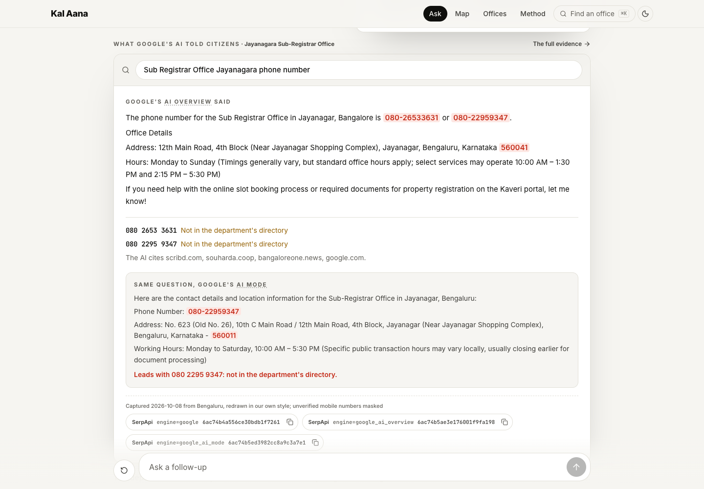
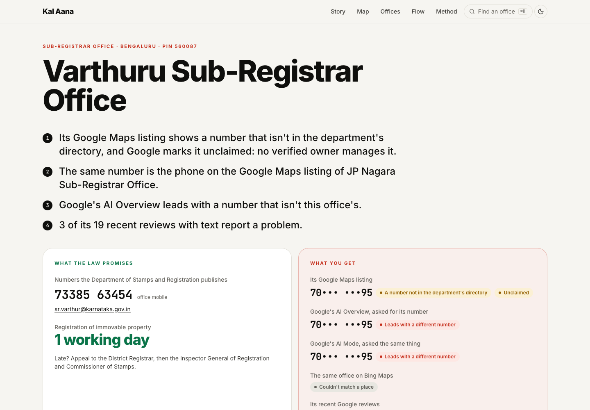
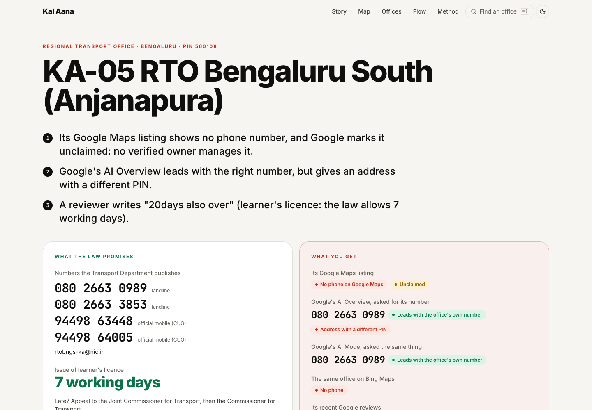
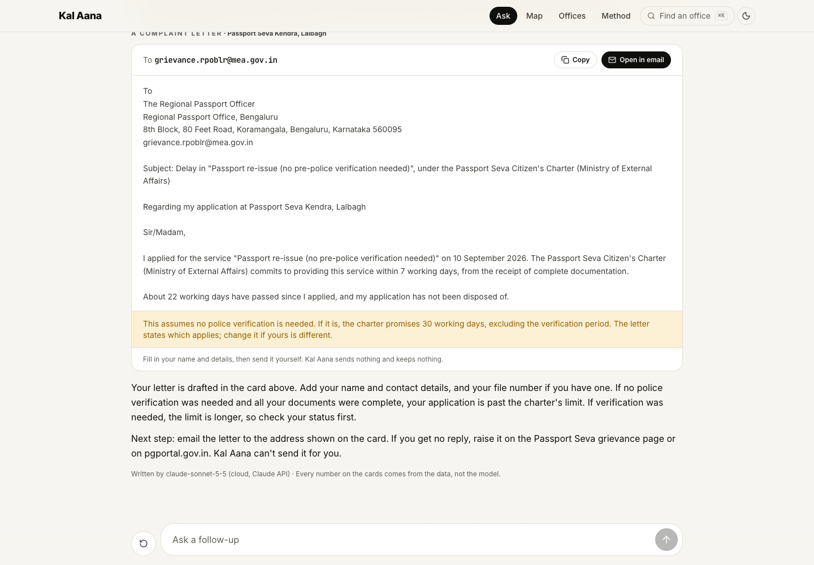

# What it found (Bengaluru, October 8, 2026)

Every finding for the three office types Kal Aana covers, each traceable to the department's directory, a Google Maps listing, a review or a SerpApi search ID.

[Back to README](../README.md)

## RTOs: all 13 that serve Bengaluru

- **The government publishes a landline for all 13. On Google Maps, 9 of the 12 RTO listings show no phone number at all**, and 11 of 12 are marked unclaimed (no verified owner manages them). KA-59 Chandapura has no listing of its own that our searches found.
- **Google's AI Overview did not lead with the office's own number in 4 of the 9 searches where it answered. Asked the same question, Google's AI Mode led with the office's own number in all 13**, with the right PIN wherever it gave one: Google has the number, but the answer on the normal results page doesn't always show it. For KA-41 (Jnanabharathi) none of its numbers is KA-41's, and one is the Devanahalli office's landline. For KA-57 it says a direct landline is "typically unlisted"; the department publishes two. For KA-01 and KA-05 it gives an address with a different PIN from the official one.

- **Bing Maps shows the same gap.** Of the 7 RTOs we could match on Bing, 5 show no phone; the 2 that do (KA-04 and KA-50) are the same 2 whose Google listings show the office's own number.
- **Reviewers report the phones going unanswered.** At KA-05: "their land line numbers is not working".
- **Possible statutory breaches, in reviewers' own words:** a learner's licence at KA-05 "20days also over" (Sakala allows 7 working days), and driving licence renewals at KA-03 ("nearly 4 weeks") and KA-04 ("over 45 days") against 10 working days. Each is one person's account, not a rate.

## Sub-registrar offices: all 43

- **The Department of Stamps and Registration publishes a phone number for all 43 (one office mobile number each). On Google Maps, 30 of the 42 listings show no phone, and none of the 12 numbers that are shown is in the department's directory.** 41 of 42 are unclaimed. A citizen who finds the office on Google has no way to tell which number, if any, is the one the department stands behind.
- **One mobile number that isn't in the department's directory is the phone on two different offices' listings, Varthur and J P Nagar.** Searched for each office's number, Google's AI calls it "the official phone number" for Varthur and gives it for J P Nagar too. It is not in the directory.
- **Google showed an AI Overview for 35 of the 42 offices searched, and none led with a number from the directory.** 33 led with a number that isn't in it; 7 repeat the number on the office's Maps listing. **AI Mode did no better here**: 1 of 42 led with the directory number. The department lists one office mobile per office and no landlines, and Google's AI doesn't find those mobiles.
- **Bing Maps:** of the 35 offices matched on Bing, 26 show no phone and none shows a directory number.
- **Reviews tell a quieter story than the surveys.** In a LocalCircles survey (September 2026), 73% of families who paid a bribe to transfer a deceased relative's assets paid it at property registration or land offices ([source](https://www.moneylife.in/article/73-percentage-families-paying-bribes-at-property-registration-land-offices-to-transfer-deceased-relatives-assets-survey/81571.html)). In the newest reviews of all 42 listed offices (333 with text from the last year), 12 report a bribe and 22 report agents or brokers, while 71 praise the office. Gandhinagara's recent reviewers mostly praise it (11 of 18). Most bribe accounts found by searching reviews for "bribe" are older (2021 to 2023). Reviews can't say whether that is a real change, fewer people writing about it, or how Google ranks keyword matches, and the lexicon is untested on sub-registrar reviews.

## Passport offices: the RPO and its 3 Bengaluru centres

Passport offices are run by the Ministry of External Affairs, so their time limits come from its Citizen's Charter (counted from complete documentation; fresh passports leave out police verification), not the Sakala law.

- **None of the 4 Google Maps listings shows the office's own number.** Two show the national call centre (1800-258-1800), and two show no phone, though the RPO's site lists a phone for every centre (for Jalahalli, the RPO's own main line).
- **9 Google Maps listings in Bengaluru are named like a passport office ("Passport Seva Kendra", "PASSPORT OFFICE") but aren't among the 4 on the RPO's list.** Google itself files 5 of them as passport agents or internet cafes. Kal Aana shows them, without their phone numbers.
- **PSK Sai Arcade moved to Whitefield on October 5.** The new centre's listing exists but shows no phone. Asked for its number, both Google's AI Overview and AI Mode say the centre has no publicly listed number of its own and lead with the national helpline, while the RPO's site lists a landline for it (080 2563 9137).

## How the claims are sourced

Every claim links to its source: the department's directory, the Sakala Service Compendium page, the Google Maps listing, the review, or the SerpApi search ID. Reviews are self-selected, so the app says "reviewers report", shows sample sizes and date ranges, and says "too few reviews" below 10.

| Report card | Office page | Complaint letter in the chat |
|---|---|---|
|  |  |  |

How these numbers were measured: [How it works](method.md). What they can't tell you: [Limitations](ethics.md#limitations).
