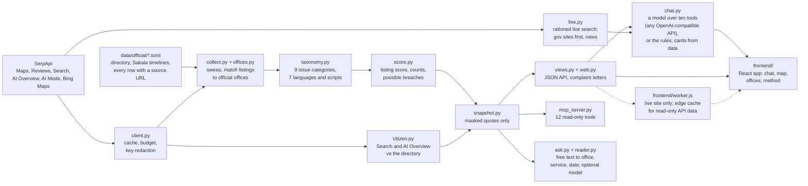

# How it works

The pipeline from official records and SerpApi searches to the snapshot, the rules behind each step, and where each part lives in the code.

[Back to README](../README.md)

## The pipeline



## The rules behind each step

- **Official ground truth** (`data/official/`): the Karnataka Transport Department's RTO directory (landlines, official mobiles, email), the Sakala Service Compendium of May 5, 2026 (each time limit cites its PDF page), the appeal path, the national Parivahan helpdesk, the Department of Stamps and Registration's sub-registrar directory, and the passport offices for the next office type. The loader is strict: a row without a source is an error.
- **Matching** (`offices.py`): a Maps listing counts as an office only if its category fits and it matches on a phone number, the office code or the location. Agents named "RTO Services" next door are kept separate and never treated as the office.
- **Issue lexicon** (`taxonomy.py`): nine categories (can't reach by phone, bribe, agents or brokers, delay, staff, portal, closed or wrong hours, queues, helpful) across English, Kannada, Hindi, Tamil, Telugu and romanised Kannada and Hindi. It handles denials ("didn't have to pay any bribe"), denials that are really claims ("without bribe nothing moves"), hypotheticals, warnings and 1-star sarcasm. Every hit carries the exact words it matched, which become the highlighted evidence. Its accuracy: [Evaluation](evaluation.md).
- **Listing score** (`score.py`): 0 to 100 from six named checks of the Maps listing: a phone shown (25), the number is the office's own (20), a government website (10), opening hours (10), managed by its owner (10), and no recent review reporting failure to get through (25). Checks that can't be decided are left out, and the basis is shown ("5 of 6 checks"). It measures what citizens find on Google, not how good the office is.
- **Possible statutory breach**: a review from the last 2 years reporting a wait at least 25% past the Sakala time limit for a service named in the same sentence. Waits that went through an agent are set aside, and promised durations ("will take 30 days") are ignored.

The SerpApi engines and parameters behind each step: [How it uses SerpApi](serpapi.md). The chat's readers and rationing: [Choosing a reader](setup.md#choosing-a-reader). Adding a new kind of office: [Adding an office type](add-an-office-type.md).

## Project layout

```
kalaana/          the package: client, collect, offices, official, citizen, crosscheck, phones, taxonomy, redact,
                  score, snapshot, models, evaluate, refine, lookup, ask, reader, chat, chat_eval, live, views,
                  web, mcp_server, paths, cli
data/official/    official directories and Sakala time limits, every row with its source
data/snapshot/    the committed snapshots (one per office type) the web app and MCP server read
data/labels/      hand-labelled reviews for evaluation (masked)
data/refined/     the local LLM's cached readings (masked)
frontend/         the React app's source (React, TypeScript, Vite, Tailwind, Motion, MapLibre, deck.gl; the home
                  hero is plain WebGL2), plus worker.js and wrangler.jsonc for the live site
kalaana/static/app/  the app, built and committed so running it needs no Node
tests/            pytest suite
docs/             screenshots, an MCP transcript, the chat eval report, how to add an office type, and these pages
```

## Libraries, fonts and map data

Libraries: FastAPI, Uvicorn, phonenumbers, python-dotenv, and optionally serpapi, the Anthropic SDK (for prompt caching; any OpenAI-compatible API needs no extra library) and the MCP Python SDK. The app: React, React Router, Vite, Tailwind CSS, Motion, MapLibre GL, deck.gl, cmdk, Radix UI and lucide icons (all MIT, ISC or similar permissive licences), the Inter, Newsreader and JetBrains Mono fonts, and the wordmark lettered from Shadows Into Light Two (Kimberly Geswein) and Hubballi (Kannada) (all SIL Open Font License 1.1). Map data &copy; OpenStreetMap contributors (ODbL), tiles by OpenFreeMap.
